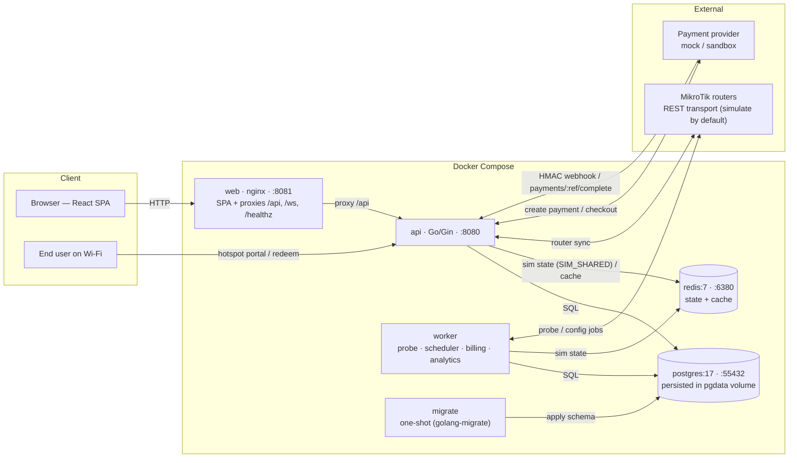
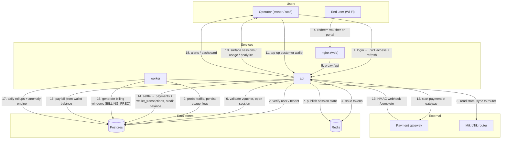
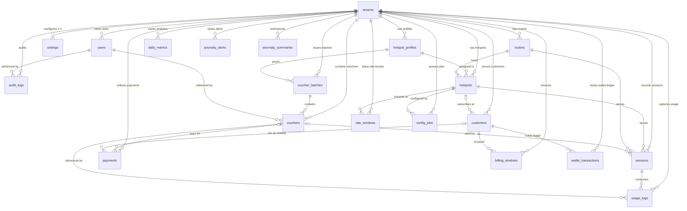
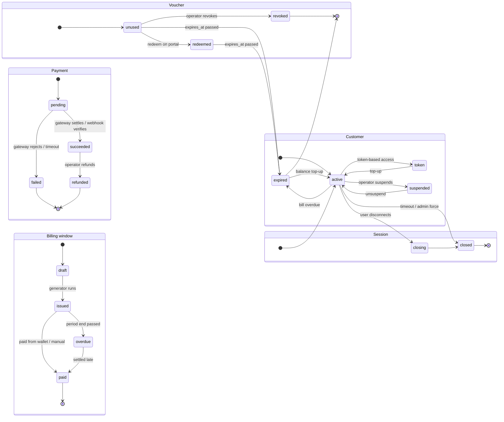
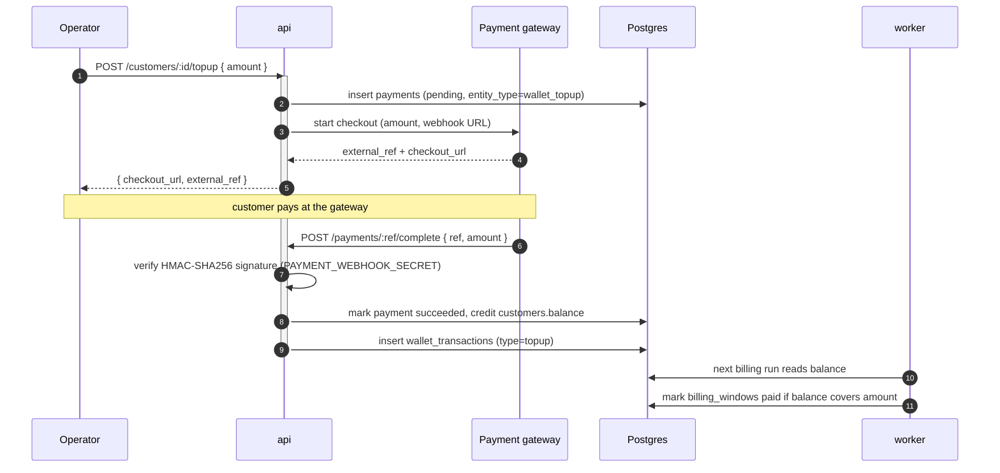

# FIHOS

Wi-Fi hotspot management — Go/Gin backend + React/Vite frontend, fully containerized.

## About this project

FIHOS is a complete software system for managing paid Wi-Fi hotspots — the kind used by internet cafés (warnets), coffee shops, and small internet providers in Southeast Asia.

One platform serves many businesses at once (multi-tenant). Each business owner can:

- **Sell internet access** — create voucher codes (e.g. "2 hours for Rp 5,000") that customers redeem to get online
- **Track customers** — keep a registry of subscribers and bill them monthly
- **Take payments** — customers pay online (wallet top-ups or instant payment), and the system keeps a record of every transaction
- **Monitor the network** — see live sessions, who is online, data usage, and how well each router/hotspot is performing
- **Boost speed on demand** — schedule temporary speed increases, e.g. during busy hours
- **Spot problems automatically** — the system watches usage patterns and raises alerts when something looks abnormal

The project is production-oriented: it ships as Docker containers (easy to deploy), has an automated test suite (unit, integration, and end-to-end), and follows a documented API and database design. It is a full-stack project — backend (Go), frontend (React), database (PostgreSQL), and caching (Redis) — built, tested, and deployed together.

The technical details below are for engineers; the summary above answers "what does this project do?"

## Stack

| Service | Image | External port | Notes |
|---|---|---|---|
| `web` | `fihos-web` (nginx) | `8081` | Serves the React app, proxies `/api`, `/ws`, `/healthz` to the API |
| `api` | `fihos-backend` | `8080` | Go/Gin API on its own port |
| `worker` | `fihos-backend` | — | Background worker (router sync/probe, billing, analytics) |
| `migrate` | `fihos-backend` | — | Runs once, then exits (golang-migrate) |
| `postgres` | `postgres:17-alpine` | `55432` | pg data persisted in the `pgdata` volume |
| `redis` | `redis:7-alpine` | `6380` | Cache/session store |

## Features

- **Multi-tenant** — tenants with `admin` (platform), `owner`, `staff` roles; admin overlays a tenant via `X-Tenant-Id`
- **Infra** — routers & hotspots; MikroTik REST sync (`simulate` mode by default, real transport included)
- **Vouchers** — batches, voucher lifecycle, revocation
- **Customers & wallet** — active/token/expired/suspended statuses, monthly billing windows, wallet with top-ups, adjustments, and payment-funded balances
- **Billing & payments** — billing window generation, pay via wallet or manual; `mock` and `sandbox` payment providers with HMAC-signed webhooks
- **Rate boost** — rate windows; scheduler apply/revert, session reconciliation
- **Sessions & usage** — live sessions, disconnect, usage logs
- **Analytics** — dashboard, traffic, top hotspots, daily rollups, anomaly engine with alerts
- **Auth** — JWT access token (+ refresh), login/refresh/logout, change/reset password

## Diagrams

### Architecture



### Data flow



### Entity relationship diagram



### State machines



### Payment flow sequence



## Requirements

- Docker Engine with Docker Compose v2 (plugin)
- Nothing else — images are built in containers

## Quick start

```bash
docker compose -f docker/docker-compose.yml up -d --build
```

First run builds the Go and frontend images (a few minutes) and applies migrations. After that:

- Frontend: http://localhost:8081
- API base: http://localhost:8080 (`/healthz`, `/readyz`, `/api/v1/...`)

For a ready-made demo dataset (6 tenants, each with hostspot/router/profile, owner account, 50 customers, billing windows, settings):

```bash
# backend must be reachable locally first — see "Running locally without Docker"
cd backend
go run ./cmd/seed
```

Seed output prints owner credentials (`owner@<slug>.dev` / `owner-<hex>`).

### Verify it's healthy

```bash
curl http://localhost:8080/readyz          # {"db":"up","redis":"up","status":"ok"}
curl http://localhost:8080/healthz         # {"status":"ok"}
curl http://localhost:8080/healthz         # also reachable via the web proxy
```

## Common commands

Run from the repository root.

| Task | Command |
|---|---|
| Start the stack | `docker compose -f docker/docker-compose.yml up -d` |
| Rebuild after code changes | `docker compose -f docker/docker-compose.yml up -d --build` |
| Show status | `docker compose -f docker/docker-compose.yml ps` |
| Follow all logs | `docker compose -f docker/docker-compose.yml logs -f` |
| Logs for one service | `docker compose -f docker/docker-compose.yml logs -f api` |
| Stop (keep data) | `docker compose -f docker/docker-compose.yml down` |
| Stop and delete DB volume | `docker compose -f docker/docker-compose.yml down -v` |
| Reset database | `docker compose -f docker/docker-compose.yml down -v && docker compose -f docker/docker-compose.yml up -d --build` |

## Configuration

Environment is defined in `docker/docker-compose.yml`. Overrides via a `.env` file next to the compose file (or environment variables), e.g.:

```bash
JWT_SECRET=change-me
```

Defaults (dev only):

- Postgres: `fihos` / `fihos` @ db `fihos`
- Redis: no auth
- `JWT_SECRET`: `dev-secret-change-me`
- `MIKROTIK_MODE`: `simulate` (set to `rest` for real routers)
- `SIM_SHARED`: `1` — shared simulated router/session state via Redis so `api` and `worker` agree
- `PAYMENT_PROVIDER`: `mock` (instant settle) or `sandbox` (async, webhook-settled)
- `PAYMENT_WEBHOOK_SECRET`: `dev-webhook-secret`
- `PAYMENT_FEE_RATE`: `0.03`
- `TOKEN_TTL` / `REFRESH_TTL`: `15m` / `168h`
- Analysis loops: `ROUTER_PROBE_FREQ`=60s, `ANALYTICS_FREQ`=5m, `BILLING_FREQ`=6h

## Running locally without Docker

Backend (Go 1.25+):

```bash
cd backend
go run ./cmd/migrate   # applies migrations
go run ./cmd/seed      # optional: demo tenants/customers/wallets
go run ./cmd/api       # API on :8080
go run ./cmd/worker    # background worker (probe, billing, analytics)
```

Set `DATABASE_URL` / `REDIS_ADDR` to `fihos:fihos@localhost:55432/fihos` and `localhost:6380` if the compose services are running.

Frontend (Node 22+):

```bash
cd frontend
npm install
npm run dev             # Vite dev server on :5174, proxy -> localhost:8080
```

## Tests

Backend units:

```bash
pwsh tests/run-backend.ps1                        # unit tests
pwsh tests/run-backend.ps1 -Integration          # + smoke/regression against running stack
```

or directly:

```bash
cd backend && go test ./internal/service/... ./internal/auth/... ./internal/response/... ./internal/middleware/...
```

Integration suite (needs the full stack up at http://localhost:8081/api/v1):

```bash
cd backend && FIHOS_API_URL=http://localhost:8081/api/v1 go test -tags integration ./itest/ -v
```

Frontend:

```bash
cd frontend
npm run lint          # eslint
npm run typecheck     # tsc --noEmit
npm test              # vitest unit tests
npm run test:e2e      # Puppeteer page-render regression (needs stack up)
```

## Project layout

```
backend/    Go API, worker, migrate, seed entrypoints (cmd/) + internals
frontend/   React + Vite SPA, vitest unit tests, Puppeteer e2e
migrations/ SQL migration files (canonical source)
docker/     Dockerfiles, nginx conf, docker-compose.yml
tests/      Backend test runner (run-backend.ps1)
docs/       PRD, SRS, API spec, DB design, plans (API-SPECIFICATION.md is the API reference)
```

## Troubleshooting

- **Port already in use** (`bind: Only one usage of each socket address`): stop whatever is on `8080`/`8081`/`5174` (e.g. a local `go run ./cmd/api` dev process), or change the `ports:` mapping in the compose file.
- **Migrations not applied**: check `docker compose logs migrate`; run `migrate` again with `docker compose -f docker/docker-compose.yml up migrate`.
- **Frontend cannot reach the API**: nginx proxies to the internal `api` service by name over the compose network; don't change service names in the compose file unless you update `docker/nginx.conf` too.
- **`api` and `worker` see different simulated router/session state**: both must share Redis — keep `SIM_SHARED=1` (set `SIM_SHARED` to anything else and each process keeps its own in-memory state).
- **Sandbox payments never settle**: payments stay `pending` until the webhook `POST /api/v1/payments/{ref}/complete` fires with a valid HMAC signature; check `PAYMENT_WEBHOOK_SECRET` matches between the sandbox gateway and this service.
- **Seed fails**: the `seed` binary only needs a reachable Postgres (`DATABASE_URL`) and must run against an empty/migrated DB; re-run `go run ./cmd/migrate` first if tables are missing.